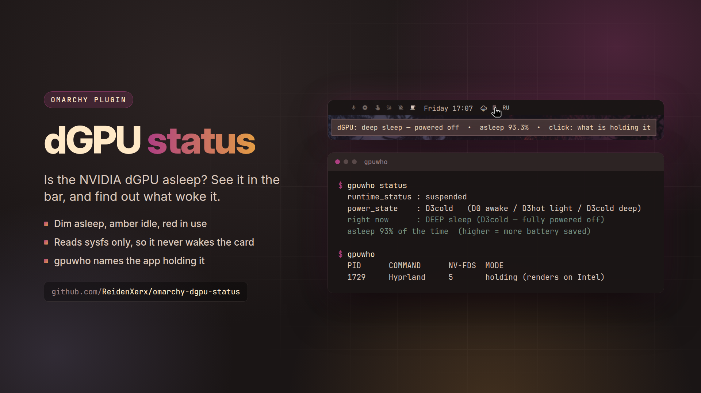

# dGPU status



An [Omarchy](https://omarchy.org) bar widget showing whether the NVIDIA discrete GPU is
**asleep or awake**, plus [`gpuwho`](#gpuwho) — a read-only CLI for seeing what is keeping
it awake.

On an Optimus laptop the dGPU should spend almost all its time powered off. When something
quietly holds it awake you lose battery with no visible symptom. This makes that visible.

## Install

```bash
omarchy plugin add https://github.com/ReidenXerx/omarchy-dgpu-status.git --enable
```

The widget hides itself on machines with no NVIDIA dGPU.

## The widget

| dGPU state | colour |
|---|---|
| `D3cold` — deep sleep, powered off | muted (nothing to see) |
| `D3hot` — light sleep, still powered | normal |
| `D0` active — in use | urgent |

**Hover** for the sleep depth and asleep-percentage. **Click** to open `gpuwho` in a floating
terminal and see exactly which processes hold the GPU open.

## gpuwho

Also usable directly (`bin/gpuwho`):

```
gpuwho                list processes that hold the dGPU open
gpuwho status         power state, runtime PM settings, asleep %
gpuwho sleep          is it in deep sleep right now? (exit 0 = yes)
gpuwho watch [secs]   log every wake and NAME the process that caused it
gpuwho why            why it can wake with nothing running, and how to trace it
gpuwho help           usage
```

`gpuwho watch` is the one worth knowing: it samples the power state and, the moment the GPU
wakes, records which processes hold `/dev/nvidia*`. `GPUWHO_POLL=0.25 gpuwho watch` samples
faster (0.1 to 60 seconds) to catch short-lived wakers.

```
21:33:17  D3cold  (baseline)
21:33:21  D0      vulkaninfo(27933)

summary over 9s
  wakes  : 1
  awake  : 5s  (55.6% of the window)
```

`gpuwho` only reports. It does not change which GPU an application uses, and it writes no
wrappers, launchers or configuration. (Earlier development versions had `pin`/`allow`
commands that did; they are not shipped.)

## The rule this is built around

Everything here reads **only** `power_state`, the runtime PM attributes (`power/runtime_status`,
`power/runtime_suspended_time`, `power/runtime_active_time`, `power/control`),
`d3cold_allowed` and `/proc`.

`config`, `current_link_speed` and `current_link_width` are never read. Querying those
touches PCI config space or the live PCIe link and **resumes the GPU** — a status tool built
the obvious way manufactures the wakeups it claims to observe. The same applies to `lspci`
and `nvidia-smi`: both wake a sleeping card. If you extend this, keep to the attributes above.

`gpuwho` likewise scans the link targets in `/proc/*/fd` rather than opening `/dev/nvidia*`.

## Notes

- The device is resolved through its bound driver — the entry of
  `/sys/bus/pci/drivers/nvidia` named like a PCI address whose link leads to the same device
  under `/sys/devices/` — not a hardcoded address, so it works on any machine.
- Processes owned by other users are invisible without root.

## Security

- **Writes nothing.** Neither the widget nor `gpuwho` creates, edits or deletes files, and
  neither uses temporary files. The only writer is the opt-in menu installer below, which
  goes through `bin/plugin_safety.py`: no symlinks followed, owner checks, a random
  `O_EXCL` temporary file in the same directory, atomic replace, size-capped reads.
- **No shell from QML, no process per poll.** At startup the widget runs
  `/usr/bin/python3 bin/dgpu-status device` once (fixed argv, 3 s watchdog) to find the
  device directory, validates the answer, then reads the four attributes with `FileView`
  every 5 s. The helper runs again, with backoff, only if the device is missing.
- **Report button.** Starts `/usr/bin/omarchy-launch-floating-terminal-with-presentation`
  detached, with the absolute path of the plugin's `gpuwho`. That launcher hands its
  argument to `bash -c`, so the path is used only if it consists of `A-Z a-z 0-9 . _ / -`,
  and is single-quoted as well. The terminal lives in its own scope and closes with the user.
- **`gpuwho`** sets `PATH=/usr/bin` and `LC_ALL=C`, accepts only its fixed subcommands
  (`watch` takes 0–86400 seconds, `GPUWHO_POLL` 0.1–60), reads sysfs through an attribute
  allowlist, runs its few external calls (`find`, `grep`) under `timeout`, and prints
  process names and arguments with control characters stripped, so a process cannot inject
  terminal escape sequences through its name.
- Tests: `python3 tests/dgpu_status_test.py`.

## Requirements

Nothing beyond a stock Omarchy install and an NVIDIA card bound to the `nvidia` driver.

## Menu entries

Optional Omarchy menu routes (power state, what is using it, watch, why):

```bash
bin/dgpu-status-menu-install          # add them
bin/dgpu-status-menu-install remove   # take them out
```

It writes only between its own marker comments in
`~/.config/omarchy/extensions/omarchy-menu.jsonc` and restores the previous content rather
than leaving that file unparseable.

## Remove

```bash
bin/dgpu-status-menu-install remove
omarchy plugin remove reidenxerx.dgpu-status
```

The widget keeps no state of its own.

## License

MIT — see [LICENSE](LICENSE).
